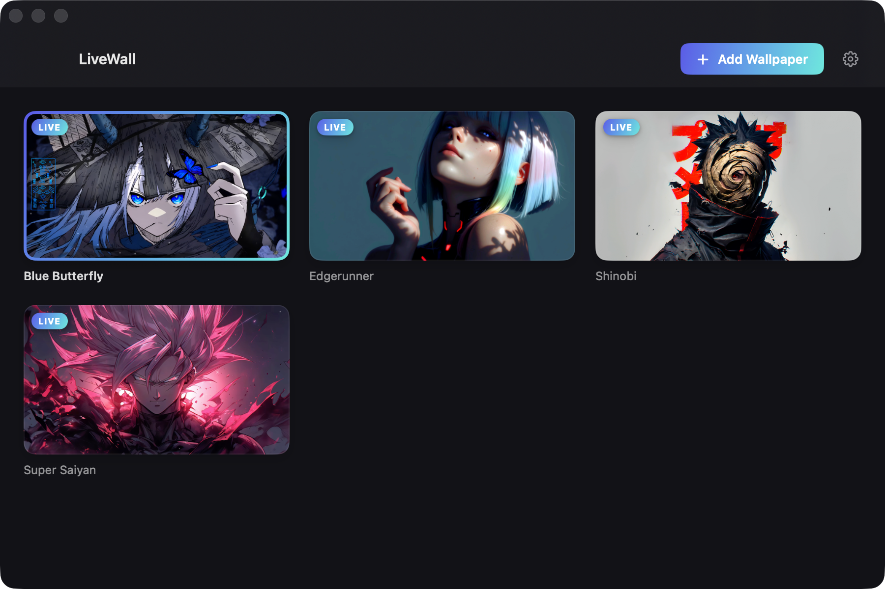

# LiveWall

Live 4K wallpapers for your Mac, without draining your battery.




[](https://github.com/lyndon050516/LiveWall/releases/latest)
[](https://github.com/lyndon050516/LiveWall/releases)

LiveWall is a free, open-source macOS menu-bar app that turns any video or photo
into your desktop wallpaper. It lives in the menu bar (no Dock icon), plays
gaplessly across every display from a single hardware decode, and is engineered
from the ground up to sip power.

## Features

- Use any video (MP4, MOV, M4V; HEVC recommended) or image (PNG, JPEG, HEIC) as your wallpaper.
- Gapless, seamless looping across all displays from one shared video decode.
- Static images use Apple's native wallpaper API, so the playback engine fully shuts down: zero runtime cost.
- Battery-smart: auto-pauses on screen lock, display sleep, full occlusion, Low Power Mode, and (optionally) on battery power.
- Never prevents your display from sleeping.
- Wallpaper gallery window with thumbnails and drag-and-drop import.
- Wallpaper library stored in Application Support; your choice survives restarts.
- Multi-display support that survives display hot-plug.
- Quick onboarding and launch-at-login.
- Native Swift, AppKit and AVFoundation. Zero third-party dependencies.

## Download and Install

1. Download the latest DMG from the [releases page](https://github.com/lyndon050516/LiveWall/releases/latest).
2. Open the DMG and drag **LiveWall** into your Applications folder.
3. Because the app is ad-hoc signed and **not notarized**, macOS Gatekeeper
   will block the first launch with a dialog saying Apple could not verify
   LiveWall is free of malware. Click **Done** (not **Move to Trash**).
4. Open **System Settings** → **Privacy & Security**, scroll down to the
   message saying LiveWall was blocked, click **Open Anyway**, and confirm.
   You only need to do this once.

Faster: skip the Settings dance entirely by clearing the quarantine attribute
in the terminal after dragging the app to Applications:

```sh
xattr -dr com.apple.quarantine /Applications/LiveWall.app
```

## Quick Start

1. Launch LiveWall. Look for its icon in the menu bar (there is no Dock icon).
2. Open the gallery from the menu bar, then drag in a video or image, or pick one you already have.
3. Select a wallpaper to apply it. It is set across every display and restored automatically on your next login.

## Where to find wallpapers

LiveWall plays your own files, and there are great free sources for live
wallpaper footage:

- [MoeWalls](https://moewalls.com)
- [MotionBGs](https://motionbgs.com)
- [DesktopHut](https://desktophut.com)
- [Pixabay](https://pixabay.com/videos/) (free stock video)

Many of these sites offer WebM downloads, which LiveWall does not play. Convert
a WebM to an HEVC `.mov` first:

```sh
ffmpeg -i input.webm -c:v hevc_videotoolbox -q:v 60 -tag:v hvc1 -an output.mov
```

The `-an` flag drops the audio track (LiveWall plays muted anyway), and
`hevc_videotoolbox` uses hardware encoding on Apple Silicon.

## How it works

LiveWall renders video into a borderless, per-display window placed exactly
**one level below the desktop icons**, so your wallpaper sits behind everything
including the Finder icons on the desktop.

For video, a single shared `AVQueuePlayer` driven by an `AVPlayerLooper` feeds
every display. That means **one hardware video decode** regardless of how many
monitors you have, and the `AVPlayerLooper` gives truly gapless looping.
Playback is always muted.

Static images bypass the engine entirely and use Apple's native wallpaper API,
so nothing runs at all once an image is set.

Playback is gated by **five auto-pause conditions**. When any of them is active,
the engine stops decoding and CPU use drops to zero:

1. Screen locked.
2. Display asleep.
3. The wallpaper is fully occluded (covered by other windows).
4. Low Power Mode is enabled.
5. Running on battery power (toggleable).

These gates are core to the design; if you contribute, please keep them intact.
LiveWall also never asserts a power assertion that would keep your display awake.

## Performance

On Apple Silicon, playing a 4K HEVC wallpaper measures roughly **1 to 3% CPU**.
When any pause gate is active, measured CPU is **0.0%**.

For the best efficiency, use **HEVC** (H.265) encoded video. It decodes on
dedicated hardware and keeps both CPU and power draw low.

## Building from source

Requires Xcode.

```sh
git clone https://github.com/lyndon050516/LiveWall.git
cd LiveWall
./scripts/build-app.sh      # produces LiveWall.app
./scripts/make-dmg.sh       # packages the app into a DMG
```

LiveWall is a SwiftPM project with zero external dependencies.

## Project layout

```
LiveWall/
├── Sources/        Swift source (AppKit UI, AVFoundation engine)
├── Resources/      App resources and assets
├── scripts/        build-app.sh, make-dmg.sh
├── docs/           Landing page and screenshots
├── Package.swift   SwiftPM manifest
└── LICENSE         MIT
```

## License

Released under the [MIT License](LICENSE).
